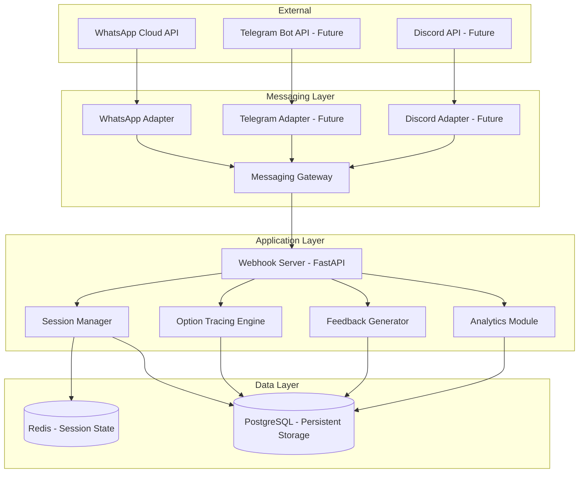
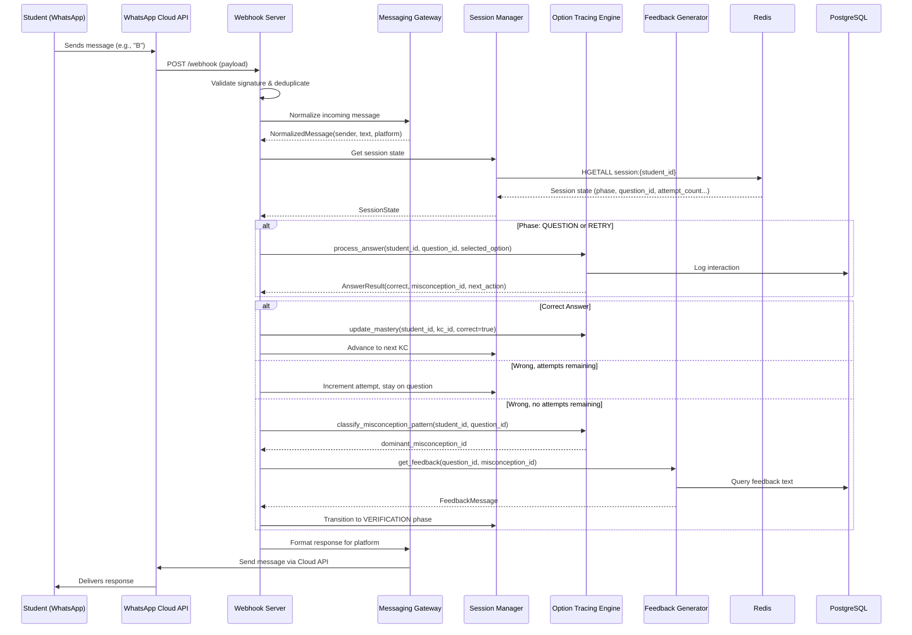
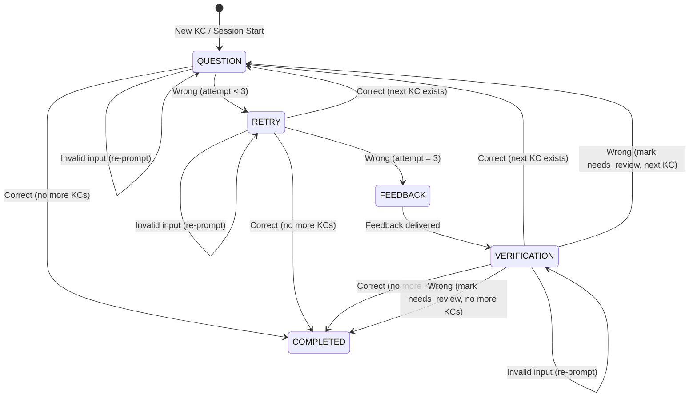

# Design Document: Option Tracing Chatbot

## Overview

This document describes the technical design for a WhatsApp-based adaptive math assessment chatbot that implements Option Tracing — a Knowledge Tracing variant that maps wrong answer options to specific misconceptions. The system extends Bayesian Knowledge Tracing (BKT) with misconception probabilities, enabling targeted feedback and producing diagnostic output for thesis research.

The baseline prototype delivers plain-text multiple-choice questions for 3 math skills via WhatsApp, with a multi-platform messaging abstraction for future Telegram/Discord support.

### Key Design Decisions

1. **FastAPI over Flask**: Async-native for handling webhook callbacks without blocking, better suited for I/O-bound work (Redis, PostgreSQL, external API calls).
2. **Custom Option Tracing Engine over pyBKT**: The thesis contribution IS the extended model — using off-the-shelf BKT defeats the purpose. The engine implements standard BKT updates plus the novel misconception probability tracking.
3. **Redis for session state, PostgreSQL for persistence**: Redis provides sub-millisecond reads for active conversation state; PostgreSQL stores the durable question bank, student records, and interaction history.
4. **Messaging Gateway abstraction**: Platform-specific adapters behind a unified interface, so the core assessment logic never touches WhatsApp/Telegram specifics directly.
5. **State machine per conversation**: Each student-session follows a deterministic state machine (question → retry → feedback → verification → next_skill), making the flow testable and predictable.

## Architecture



### Request Flow



## Components and Interfaces

### 1. Messaging Gateway

**Purpose**: Abstracts platform-specific messaging APIs behind a unified interface.

```python
# messaging/gateway.py
from abc import ABC, abstractmethod
from dataclasses import dataclass
from enum import Enum

class Platform(Enum):
    WHATSAPP = "whatsapp"
    TELEGRAM = "telegram"
    DISCORD = "discord"

@dataclass
class NormalizedMessage:
    sender_id: str          # Platform-specific user identifier
    message_text: str       # Raw text content
    message_id: str         # Platform message ID (for deduplication)
    platform: Platform
    timestamp: float

@dataclass
class OutgoingMessage:
    recipient_id: str
    text: str
    platform: Platform

class MessagingAdapter(ABC):
    @abstractmethod
    async def normalize(self, raw_payload: dict) -> NormalizedMessage | None:
        """Convert platform-specific payload to normalized format. Returns None for non-message events."""
        ...

    @abstractmethod
    async def send(self, message: OutgoingMessage) -> bool:
        """Send a message via the platform API. Returns True on success."""
        ...

    @abstractmethod
    def validate_webhook(self, headers: dict, body: bytes) -> bool:
        """Validate incoming webhook signature."""
        ...

class MessagingGateway:
    def __init__(self, adapters: dict[Platform, MessagingAdapter]):
        self._adapters = adapters

    async def normalize(self, platform: Platform, raw_payload: dict) -> NormalizedMessage | None:
        return await self._adapters[platform].normalize(raw_payload)

    async def send(self, message: OutgoingMessage) -> bool:
        return await self._adapters[message.platform].send(message)

    def validate_webhook(self, platform: Platform, headers: dict, body: bytes) -> bool:
        return self._adapters[platform].validate_webhook(headers, body)
```

### 2. WhatsApp Adapter

**Purpose**: Implements the MessagingAdapter for WhatsApp Cloud API.

```python
# messaging/whatsapp_adapter.py
import hashlib
import hmac
import httpx
from .gateway import MessagingAdapter, NormalizedMessage, OutgoingMessage, Platform

class WhatsAppAdapter(MessagingAdapter):
    def __init__(self, phone_number_id: str, access_token: str, verify_token: str, app_secret: str):
        self._phone_number_id = phone_number_id
        self._access_token = access_token
        self._verify_token = verify_token
        self._app_secret = app_secret
        self._api_base = f"https://graph.facebook.com/v18.0/{phone_number_id}/messages"

    async def normalize(self, raw_payload: dict) -> NormalizedMessage | None:
        """Extract message from WhatsApp webhook payload structure."""
        try:
            entry = raw_payload["entry"][0]
            change = entry["changes"][0]["value"]
            if "messages" not in change:
                return None  # Status update, not a message
            msg = change["messages"][0]
            contact = change["contacts"][0]
            return NormalizedMessage(
                sender_id=msg["from"],
                message_text=msg.get("text", {}).get("body", ""),
                message_id=msg["id"],
                platform=Platform.WHATSAPP,
                timestamp=float(msg["timestamp"]),
            )
        except (KeyError, IndexError):
            return None

    async def send(self, message: OutgoingMessage) -> bool:
        """Send text message via WhatsApp Cloud API."""
        async with httpx.AsyncClient() as client:
            response = await client.post(
                self._api_base,
                headers={"Authorization": f"Bearer {self._access_token}"},
                json={
                    "messaging_product": "whatsapp",
                    "to": message.recipient_id,
                    "type": "text",
                    "text": {"body": message.text},
                },
            )
            return response.status_code == 200

    def validate_webhook(self, headers: dict, body: bytes) -> bool:
        """Validate X-Hub-Signature-256 header."""
        signature = headers.get("x-hub-signature-256", "")
        if not signature.startswith("sha256="):
            return False
        expected = hmac.new(
            self._app_secret.encode(), body, hashlib.sha256
        ).hexdigest()
        return hmac.compare_digest(signature[7:], expected)
```

### 3. Webhook Server

**Purpose**: FastAPI application handling HTTP endpoints for webhook verification and message processing.

```python
# server/webhook.py
from fastapi import FastAPI, Request, Response, HTTPException
from .dependencies import get_gateway, get_session_manager, get_engine

app = FastAPI()

@app.get("/webhook")
async def verify_webhook(hub_mode: str = "", hub_verify_token: str = "", hub_challenge: str = ""):
    """WhatsApp webhook verification endpoint."""
    if hub_mode == "subscribe" and hub_verify_token == VERIFY_TOKEN:
        return Response(content=hub_challenge, media_type="text/plain")
    raise HTTPException(status_code=403, detail="Verification failed")

@app.post("/webhook")
async def handle_webhook(request: Request):
    """Process incoming WhatsApp messages."""
    body = await request.body()
    gateway = get_gateway()

    if not gateway.validate_webhook(Platform.WHATSAPP, dict(request.headers), body):
        raise HTTPException(status_code=403, detail="Invalid signature")

    payload = await request.json()
    message = await gateway.normalize(Platform.WHATSAPP, payload)

    if message is None:
        return {"status": "ok"}  # Non-message event (status update)

    # Deduplication check
    if await is_duplicate(message.message_id):
        return {"status": "ok"}

    # Process message through assessment flow
    response_text = await process_message(message)

    # Send response
    await gateway.send(OutgoingMessage(
        recipient_id=message.sender_id,
        text=response_text,
        platform=message.platform,
    ))

    return {"status": "ok"}
```

### 4. Session Manager

**Purpose**: Manages conversation state per student in Redis with PostgreSQL fallback for persistence.

```python
# session/manager.py
from dataclasses import dataclass
from enum import Enum
from typing import Optional
import json

class FlowPhase(Enum):
    QUESTION = "question"
    RETRY = "retry"
    FEEDBACK = "feedback"
    VERIFICATION = "verification"
    COMPLETED = "completed"

@dataclass
class SessionState:
    student_id: str
    current_kc_id: str
    current_question_id: Optional[str]
    attempt_count: int
    flow_phase: FlowPhase
    selected_options: list[dict]  # [{attempt: int, option: str, misconception_id: str}]
    session_id: str

class SessionManager:
    SESSION_TTL = 86400  # 24 hours (WhatsApp conversation window)

    def __init__(self, redis_client, db_pool):
        self._redis = redis_client
        self._db = db_pool

    async def get_session(self, student_id: str) -> Optional[SessionState]:
        """Load session from Redis, fall back to PostgreSQL for resumption."""
        key = f"session:{student_id}"
        data = await self._redis.hgetall(key)
        if data:
            return self._deserialize(data)
        # Fall back: load last progress from PostgreSQL
        return await self._load_from_db(student_id)

    async def save_session(self, state: SessionState) -> None:
        """Persist session state to Redis with TTL."""
        key = f"session:{state.student_id}"
        await self._redis.hset(key, mapping=self._serialize(state))
        await self._redis.expire(key, self.SESSION_TTL)

    async def persist_progress(self, state: SessionState) -> None:
        """Save progress to PostgreSQL for cross-session continuity."""
        # Called on session expiry or explicit save points
        ...

    async def increment_attempt(self, state: SessionState) -> SessionState:
        """Increment attempt count, transition phase if max reached."""
        state.attempt_count += 1
        if state.attempt_count >= 3:
            state.flow_phase = FlowPhase.FEEDBACK
        else:
            state.flow_phase = FlowPhase.RETRY
        await self.save_session(state)
        return state

    def _serialize(self, state: SessionState) -> dict:
        return {
            "student_id": state.student_id,
            "current_kc_id": state.current_kc_id,
            "current_question_id": state.current_question_id or "",
            "attempt_count": str(state.attempt_count),
            "flow_phase": state.flow_phase.value,
            "selected_options": json.dumps(state.selected_options),
            "session_id": state.session_id,
        }

    def _deserialize(self, data: dict) -> SessionState:
        return SessionState(
            student_id=data["student_id"],
            current_kc_id=data["current_kc_id"],
            current_question_id=data["current_question_id"] or None,
            attempt_count=int(data["attempt_count"]),
            flow_phase=FlowPhase(data["flow_phase"]),
            selected_options=json.loads(data["selected_options"]),
            session_id=data["session_id"],
        )
```

### 5. Option Tracing Engine

**Purpose**: Core computational module implementing BKT updates extended with misconception probability tracking.

```python
# engine/option_tracing.py
from dataclasses import dataclass
from typing import Optional

@dataclass
class BKTParams:
    p_l0: float       # Initial mastery probability
    p_guess: float    # Probability of guessing correctly
    p_slip: float     # Probability of slipping (knowing but answering wrong)
    p_transit: float  # Probability of learning transition

@dataclass
class StudentMastery:
    student_id: str
    kc_id: str
    p_mastery: float
    p_transition: float
    misconception_probs: dict[str, float]  # {misconception_id: probability}
    last_updated: float

@dataclass
class AnswerResult:
    is_correct: bool
    misconception_id: Optional[str]
    attempt_number: int
    updated_mastery: StudentMastery

class OptionTracingEngine:
    def __init__(self, db_pool, bkt_params: dict[str, BKTParams]):
        self._db = db_pool
        self._params = bkt_params  # Per-KC BKT parameters

    async def process_answer(
        self, student_id: str, question_id: str, selected_option: str
    ) -> AnswerResult:
        """Process a student's answer, identify misconception if wrong, update probabilities."""
        question = await self._get_question(question_id)
        is_correct = selected_option.upper() == question.correct_option

        misconception_id = None
        if not is_correct:
            misconception_id = question.distractor_map.get(selected_option.upper())

        # Log interaction
        await self._log_interaction(student_id, question_id, selected_option, misconception_id)

        # Update BKT mastery
        mastery = await self._update_mastery(student_id, question.kc_id, is_correct)

        # Update misconception probability if wrong
        if misconception_id:
            await self._update_misconception_prob(student_id, question.kc_id, misconception_id)

        return AnswerResult(
            is_correct=is_correct,
            misconception_id=misconception_id,
            attempt_number=await self._get_attempt_count(student_id, question_id),
            updated_mastery=mastery,
        )

    async def _update_mastery(self, student_id: str, kc_id: str, correct: bool) -> StudentMastery:
        """Standard BKT posterior update extended with transition rate estimation."""
        mastery = await self._load_mastery(student_id, kc_id)
        params = self._params[kc_id]

        # BKT posterior: P(mastery | observation)
        if correct:
            # P(mastery | correct) = P(correct | mastery) * P(mastery) / P(correct)
            p_correct_given_mastery = 1 - params.p_slip
            p_correct_given_not_mastery = params.p_guess
            p_correct = (p_correct_given_mastery * mastery.p_mastery +
                        p_correct_given_not_mastery * (1 - mastery.p_mastery))
            posterior = (p_correct_given_mastery * mastery.p_mastery) / p_correct
        else:
            # P(mastery | incorrect) = P(incorrect | mastery) * P(mastery) / P(incorrect)
            p_incorrect_given_mastery = params.p_slip
            p_incorrect_given_not_mastery = 1 - params.p_guess
            p_incorrect = (p_incorrect_given_mastery * mastery.p_mastery +
                          p_incorrect_given_not_mastery * (1 - mastery.p_mastery))
            posterior = (p_incorrect_given_mastery * mastery.p_mastery) / p_incorrect

        # Transition update: P(mastery after practice) = P(mastery) + P(transition) * (1 - P(mastery))
        mastery.p_mastery = posterior + mastery.p_transition * (1 - posterior)
        mastery.p_mastery = max(0.0, min(1.0, mastery.p_mastery))

        await self._save_mastery(mastery)
        return mastery

    async def _update_misconception_prob(
        self, student_id: str, kc_id: str, misconception_id: str
    ) -> None:
        """Update P(misconception) based on option selection frequency."""
        mastery = await self._load_mastery(student_id, kc_id)
        # Increment count for selected misconception, compute empirical frequency
        history = await self._get_misconception_history(student_id, kc_id)
        total_wrong = sum(history.values())
        for m_id, count in history.items():
            mastery.misconception_probs[m_id] = count / total_wrong if total_wrong > 0 else 0.0
        await self._save_mastery(mastery)

    async def classify_misconception_pattern(
        self, student_id: str, question_id: str
    ) -> tuple[str, str]:
        """
        Classify misconception pattern for a question's attempts.
        Returns (dominant_misconception_id, pattern_type: 'consistent' | 'varied').
        """
        interactions = await self._get_question_interactions(student_id, question_id)
        misconception_counts: dict[str, int] = {}
        last_misconception: Optional[str] = None

        for interaction in interactions:
            if interaction.misconception_id:
                misconception_counts[interaction.misconception_id] = (
                    misconception_counts.get(interaction.misconception_id, 0) + 1
                )
                last_misconception = interaction.misconception_id

        if not misconception_counts:
            return ("unknown", "varied")

        max_count = max(misconception_counts.values())
        dominant_candidates = [m for m, c in misconception_counts.items() if c == max_count]

        # Pattern classification: consistent if any misconception appears >= 2 times
        pattern = "consistent" if max_count >= 2 else "varied"

        # Tie-breaking: use most recent attempt
        if len(dominant_candidates) > 1:
            dominant = last_misconception
        else:
            dominant = dominant_candidates[0]

        return (dominant, pattern)

    async def get_next_kc(self, student_id: str, current_kc_id: str) -> Optional[str]:
        """Determine next Knowledge Component from KC graph based on prerequisite relationships."""
        kc_graph = await self._load_kc_graph()
        # Return next unmastered KC in topological order
        ...

    async def initialize_student(self, student_id: str) -> None:
        """Initialize mastery records for a new student using pre-calibrated P(L₀) values."""
        for kc_id, params in self._params.items():
            mastery = StudentMastery(
                student_id=student_id,
                kc_id=kc_id,
                p_mastery=params.p_l0,
                p_transition=params.p_transit,
                misconception_probs={},  # All start at 0.0
                last_updated=0.0,
            )
            await self._save_mastery(mastery)
```

### 6. Feedback Generator

**Purpose**: Retrieves and formats misconception-specific feedback from the Question Bank.

```python
# feedback/generator.py
from dataclasses import dataclass

@dataclass
class FeedbackContent:
    misconception_name: str
    misconception_description: str
    why_incorrect: str
    correct_method: str
    is_generic: bool  # True if fallback to generic feedback

class FeedbackGenerator:
    def __init__(self, db_pool):
        self._db = db_pool

    async def get_feedback(self, question_id: str, misconception_id: str) -> FeedbackContent:
        """Retrieve misconception-specific feedback. Falls back to generic if not available."""
        feedback = await self._query_feedback(misconception_id)
        if feedback:
            return FeedbackContent(
                misconception_name=feedback["name"],
                misconception_description=feedback["description"],
                why_incorrect=feedback["why_incorrect"],
                correct_method=feedback["correct_method"],
                is_generic=False,
            )
        # Fallback: generic feedback with correct answer
        question = await self._query_question(question_id)
        return FeedbackContent(
            misconception_name="",
            misconception_description="",
            why_incorrect="",
            correct_method=question["correct_explanation"],
            is_generic=True,
        )

    def format_feedback_message(self, feedback: FeedbackContent) -> str:
        """Format feedback into plain-text WhatsApp message."""
        if feedback.is_generic:
            return (
                "📝 Feedback:\n\n"
                f"Cara yang benar:\n{feedback.correct_method}"
            )
        return (
            "📝 Feedback:\n\n"
            f"Miskonsepsi yang terdeteksi: {feedback.misconception_name}\n"
            f"{feedback.misconception_description}\n\n"
            f"Mengapa keliru:\n{feedback.why_incorrect}\n\n"
            f"Cara yang benar:\n{feedback.correct_method}"
        )
```

### 7. Analytics Module

**Purpose**: Aggregates interaction data and exports research datasets.

```python
# analytics/module.py
import csv
import hashlib
from io import StringIO
from dataclasses import dataclass

@dataclass
class LearningTrajectory:
    anonymized_student_id: str
    interactions: list[dict]  # Ordered by timestamp

class AnalyticsModule:
    def __init__(self, db_pool):
        self._db = db_pool

    async def export_learning_trajectories(self) -> str:
        """Export per-student interaction sequences as CSV."""
        ...

    async def export_misconception_frequencies(self) -> str:
        """Export population-level misconception frequency per KC."""
        ...

    async def export_diagnostic_outputs(self) -> str:
        """Export P(mastery), P(transition), P(misconception) for all students."""
        ...

    def _anonymize_student_id(self, student_id: str) -> str:
        """One-way hash for research ethics compliance."""
        return hashlib.sha256(student_id.encode()).hexdigest()[:16]
```

### 8. Input Validator

**Purpose**: Validates and normalizes student responses.

```python
# validation/input_validator.py

class InputValidator:
    VALID_OPTIONS = {"A", "B", "C", "D"}

    @staticmethod
    def validate_answer(text: str) -> tuple[bool, str | None]:
        """
        Validate student answer input.
        Returns (is_valid, normalized_option).
        Strips whitespace, case-insensitive.
        """
        cleaned = text.strip().upper()
        if cleaned in InputValidator.VALID_OPTIONS:
            return (True, cleaned)
        return (False, None)
```

## Data Models

### PostgreSQL Schema

```sql
-- Knowledge Components (skills in the KC graph)
CREATE TABLE knowledge_components (
    id VARCHAR(50) PRIMARY KEY,
    name VARCHAR(200) NOT NULL,
    description TEXT,
    prerequisite_kc_id VARCHAR(50) REFERENCES knowledge_components(id),
    display_order INTEGER NOT NULL
);

-- Misconceptions associated with each KC
CREATE TABLE misconceptions (
    id VARCHAR(50) PRIMARY KEY,
    kc_id VARCHAR(50) NOT NULL REFERENCES knowledge_components(id),
    name VARCHAR(200) NOT NULL,
    description TEXT NOT NULL,
    why_incorrect TEXT NOT NULL,
    correct_method TEXT NOT NULL
);

-- Question bank with distractor-misconception mappings
CREATE TABLE questions (
    id VARCHAR(50) PRIMARY KEY,
    kc_id VARCHAR(50) NOT NULL REFERENCES knowledge_components(id),
    question_text TEXT NOT NULL,
    correct_option CHAR(1) NOT NULL CHECK (correct_option IN ('A', 'B', 'C', 'D')),
    option_a TEXT NOT NULL,
    option_b TEXT NOT NULL,
    option_c TEXT NOT NULL,
    option_d TEXT NOT NULL,
    is_verification BOOLEAN DEFAULT FALSE,
    target_misconception_id VARCHAR(50) REFERENCES misconceptions(id)
);

-- Distractor-to-misconception mapping per question
CREATE TABLE distractor_mappings (
    question_id VARCHAR(50) NOT NULL REFERENCES questions(id),
    option_letter CHAR(1) NOT NULL CHECK (option_letter IN ('A', 'B', 'C', 'D')),
    misconception_id VARCHAR(50) NOT NULL REFERENCES misconceptions(id),
    PRIMARY KEY (question_id, option_letter)
);

-- Students (phone numbers stored as hashes)
CREATE TABLE students (
    id VARCHAR(50) PRIMARY KEY,
    phone_hash VARCHAR(64) NOT NULL UNIQUE,
    created_at TIMESTAMP DEFAULT NOW(),
    last_active_at TIMESTAMP DEFAULT NOW()
);

-- Student mastery state per KC
CREATE TABLE student_mastery (
    student_id VARCHAR(50) NOT NULL REFERENCES students(id),
    kc_id VARCHAR(50) NOT NULL REFERENCES knowledge_components(id),
    p_mastery FLOAT NOT NULL DEFAULT 0.0 CHECK (p_mastery BETWEEN 0.0 AND 1.0),
    p_transition FLOAT NOT NULL DEFAULT 0.0 CHECK (p_transition BETWEEN 0.0 AND 1.0),
    status VARCHAR(20) DEFAULT 'active' CHECK (status IN ('active', 'mastered', 'needs_review')),
    last_updated TIMESTAMP DEFAULT NOW(),
    PRIMARY KEY (student_id, kc_id)
);

-- Per-misconception probability tracking
CREATE TABLE student_misconception_probs (
    student_id VARCHAR(50) NOT NULL REFERENCES students(id),
    kc_id VARCHAR(50) NOT NULL REFERENCES knowledge_components(id),
    misconception_id VARCHAR(50) NOT NULL REFERENCES misconceptions(id),
    probability FLOAT NOT NULL DEFAULT 0.0 CHECK (probability BETWEEN 0.0 AND 1.0),
    occurrence_count INTEGER DEFAULT 0,
    last_updated TIMESTAMP DEFAULT NOW(),
    PRIMARY KEY (student_id, kc_id, misconception_id)
);

-- Interaction log (every answer attempt)
CREATE TABLE interactions (
    id SERIAL PRIMARY KEY,
    student_id VARCHAR(50) NOT NULL REFERENCES students(id),
    question_id VARCHAR(50) NOT NULL REFERENCES questions(id),
    session_id VARCHAR(50) NOT NULL,
    attempt_number INTEGER NOT NULL CHECK (attempt_number BETWEEN 1 AND 3),
    selected_option CHAR(1) NOT NULL CHECK (selected_option IN ('A', 'B', 'C', 'D')),
    is_correct BOOLEAN NOT NULL,
    misconception_id VARCHAR(50) REFERENCES misconceptions(id),
    timestamp TIMESTAMP DEFAULT NOW()
);

-- Verification results
CREATE TABLE verification_results (
    id SERIAL PRIMARY KEY,
    student_id VARCHAR(50) NOT NULL REFERENCES students(id),
    kc_id VARCHAR(50) NOT NULL REFERENCES knowledge_components(id),
    verification_question_id VARCHAR(50) NOT NULL REFERENCES questions(id),
    selected_option CHAR(1) NOT NULL,
    is_correct BOOLEAN NOT NULL,
    misconception_id_targeted VARCHAR(50) REFERENCES misconceptions(id),
    timestamp TIMESTAMP DEFAULT NOW()
);

-- Student progress (for cross-session resumption)
CREATE TABLE student_progress (
    student_id VARCHAR(50) NOT NULL REFERENCES students(id),
    current_kc_id VARCHAR(50) NOT NULL REFERENCES knowledge_components(id),
    completed_kc_ids TEXT[] DEFAULT '{}',
    last_session_id VARCHAR(50),
    updated_at TIMESTAMP DEFAULT NOW(),
    PRIMARY KEY (student_id)
);

-- Indexes for common queries
CREATE INDEX idx_interactions_student ON interactions(student_id, timestamp);
CREATE INDEX idx_interactions_session ON interactions(session_id);
CREATE INDEX idx_student_mastery_student ON student_mastery(student_id);
CREATE INDEX idx_questions_kc ON questions(kc_id);
CREATE INDEX idx_questions_verification ON questions(kc_id, is_verification, target_misconception_id);
```

### Redis Session Schema

```
Key: session:{student_id}
Type: Hash
TTL: 86400 (24 hours)

Fields:
  student_id        -> string
  current_kc_id     -> string
  current_question_id -> string
  attempt_count     -> integer (0-3)
  flow_phase        -> enum: question|retry|feedback|verification|completed
  selected_options  -> JSON array: [{attempt, option, misconception_id}]
  session_id        -> string (UUID)
```

### Conversation State Machine




## Correctness Properties

*A property is a characteristic or behavior that should hold true across all valid executions of a system — essentially, a formal statement about what the system should do. Properties serve as the bridge between human-readable specifications and machine-verifiable correctness guarantees.*

### Property 1: Question formatting structure

*For any* question object with a stem and 4 options, formatting it for delivery SHALL produce a string containing the question stem followed by exactly 4 labeled options (A, B, C, D), each on a separate line.

**Validates: Requirements 1.2**

### Property 2: Valid input acceptance

*For any* single character from {A, B, C, D} with arbitrary leading/trailing whitespace and in any case (upper or lower), the input validator SHALL accept it and return the normalized uppercase letter.

**Validates: Requirements 1.3**

### Property 3: Invalid input preserves attempt count

*For any* string that is NOT a single letter A-D (after trimming whitespace), processing it SHALL leave the session's attempt_count unchanged and the flow_phase unchanged.

**Validates: Requirements 1.4, 3.2**

### Property 4: Correct answer advances to next KC

*For any* session with a pending Knowledge_Component and a question with a known correct answer, submitting the correct option SHALL transition the session's current_kc_id to the next KC in the graph (or to COMPLETED if none remain).

**Validates: Requirements 1.5, 1.6**

### Property 5: Distractor-misconception mapping integrity

*For any* question in the Question_Bank, each distractor option (non-correct option) SHALL map to exactly one Misconception, and the correct option SHALL NOT appear in the distractor mapping.

**Validates: Requirements 2.1**

### Property 6: Option-to-misconception identification

*For any* question and any wrong option selected by a student, the Option_Tracing_Engine SHALL return the misconception_id that matches the distractor-misconception mapping stored for that question and option.

**Validates: Requirements 2.2**

### Property 7: Interaction logging completeness

*For any* wrong answer processed by the engine, the resulting interaction log entry SHALL contain all of: selected_option, misconception_id, attempt_number, student_id, question_id, and a non-null timestamp.

**Validates: Requirements 2.3**

### Property 8: Misconception pattern classification

*For any* sequence of 1-3 wrong answer attempts on a single question, the classification SHALL be "consistent" if any single misconception was selected >= 2 times, or "varied" otherwise. When multiple misconceptions have equal maximum frequency, the dominant misconception SHALL be the one from the most recent attempt.

**Validates: Requirements 2.4, 2.5, 4.4**

### Property 9: Attempt counting and feedback trigger

*For any* session where a student submits valid wrong answers, the attempt_count SHALL increment by exactly 1 per valid wrong answer, and when attempt_count reaches 3, the flow_phase SHALL transition to FEEDBACK.

**Validates: Requirements 3.1, 3.2, 3.3**

### Property 10: Session context preservation during retry

*For any* session in the retry phase, after processing a wrong answer, the session SHALL preserve the same question_id, accumulate the new selected option in the history with its attempt number, and correctly reflect the updated attempt_count.

**Validates: Requirements 3.4**

### Property 11: Feedback message structure

*For any* non-generic feedback (where misconception feedback text exists), the formatted message SHALL contain three sequential components: (a) the misconception name and description, (b) an explanation of why it's incorrect, (c) the correct solving method.

**Validates: Requirements 4.2**

### Property 12: Verification question selection constraints

*For any* KC and misconception pair where verification questions exist, the selected verification question SHALL: (a) be different from the original question, (b) belong to the same KC, and (c) have distractors mapped to the same misconception.

**Validates: Requirements 5.1, 5.4**

### Property 13: Verification phase state transitions

*For any* session in the verification phase, if the student answers correctly the KC status SHALL become "mastered", and if incorrectly the KC status SHALL become "needs_review". In both cases, exactly 1 attempt is consumed and the phase ends.

**Validates: Requirements 5.2, 5.3, 5.5**

### Property 14: BKT probability bounds invariant

*For any* sequence of student interactions (correct or incorrect answers), all computed probability values — P(mastery), P(transition), and P(misconception) — SHALL remain within the closed interval [0.0, 1.0].

**Validates: Requirements 6.1, 6.2, 6.3**

### Property 15: KC graph traversal respects prerequisites

*For any* student and current KC, the next KC selected by the engine SHALL only be a KC whose prerequisites (as defined in the KC graph) have all been completed or mastered by the student.

**Validates: Requirements 6.5**

### Property 16: New student initialization

*For any* newly registered student, P(mastery) SHALL equal the pre-calibrated P(L₀) for each KC, P(transition) SHALL equal the pre-calibrated initial learning rate, and P(misconception) SHALL be 0.0 for all misconceptions across all KCs.

**Validates: Requirements 6.6, 12.1**

### Property 17: Session state serialization round-trip

*For any* valid SessionState object, serializing it to the Redis hash format and then deserializing it back SHALL produce an equivalent SessionState with all fields preserved (student_id, current_kc_id, current_question_id, attempt_count, flow_phase, selected_options, session_id).

**Validates: Requirements 7.1**

### Property 18: Webhook signature validation

*For any* payload and HMAC-SHA256 signature pair, the webhook server SHALL accept the request only if the signature matches the expected HMAC computed with the app secret. Invalid or missing signatures SHALL be rejected.

**Validates: Requirements 8.2**

### Property 19: Message deduplication (idempotency)

*For any* message processed by the webhook server, submitting the same message_id a second time SHALL result in no additional processing (no new interaction logged, no state change) while still returning HTTP 200.

**Validates: Requirements 8.5**

### Property 20: Message normalization

*For any* valid platform-specific webhook payload, the messaging gateway's normalize function SHALL produce a NormalizedMessage containing a non-empty sender_id, the message text, and the correct platform identifier.

**Validates: Requirements 11.2**

### Property 21: Export records ordered by timestamp

*For any* per-student learning trajectory export, the interaction records for each student SHALL be strictly ordered by ascending timestamp.

**Validates: Requirements 10.1**

### Property 22: Export anonymization

*For any* data export produced by the Analytics_Module, the output SHALL contain zero occurrences of any raw student phone number. All student identifiers SHALL be one-way hashes of the original.

**Validates: Requirements 10.5**

### Property 23: Student progress resumption round-trip

*For any* student whose progress has been persisted to PostgreSQL, loading their session in a new conversation SHALL resume from the correct current KC with the correct set of completed KCs.

**Validates: Requirements 12.2, 7.3**

### Property 24: Phone number stored as hash

*For any* registered student, the value stored in the phone_hash database column SHALL NOT equal the raw phone number input and SHALL be a deterministic hash of the original phone number.

**Validates: Requirements 12.3**

## Error Handling

### Error Categories and Responses

| Error Type | Trigger | Response to Student | System Action |
|-----------|---------|-------------------|---------------|
| Invalid input | Unrecognized message text | "Silakan balas dengan A, B, C, atau D" | No state change, no attempt consumed |
| Redis unavailable | Connection failure or timeout | "Maaf, sistem sedang gangguan. Silakan coba lagi nanti." | Log error, return HTTP 200 to WhatsApp |
| Missing verification question | No verification Q for KC+misconception | Skip verification silently | Set KC status to "needs_review", log event |
| Missing feedback text | No feedback for misconception ID | Deliver generic feedback with correct answer | Log missing data event |
| WhatsApp API failure | Send message returns non-200 | (no response delivered) | Retry with exponential backoff (max 3 retries) |
| Duplicate message | Same message_id received again | (no response) | Ignore, return HTTP 200 |
| Invalid webhook signature | HMAC mismatch | (no response) | Return HTTP 403, log attempt |
| Database connection failure | PostgreSQL unreachable | "Maaf, sistem sedang gangguan. Silakan coba lagi nanti." | Log error, circuit breaker |
| Session expired mid-flow | 24h window closed, student returns | Resume from last persisted KC | Load progress from PostgreSQL |

### Resilience Patterns

1. **Deduplication cache**: Store processed message IDs in Redis with short TTL (1 hour) to handle WhatsApp's retry behavior.
2. **Circuit breaker**: For PostgreSQL and Redis connections, use circuit breaker pattern to fail fast and avoid cascading timeouts.
3. **Graceful degradation**: If Redis fails, the system can still process messages using PostgreSQL directly (slower but functional for low traffic).
4. **Idempotent operations**: All state transitions are designed to be idempotent — processing the same message twice produces the same final state.

## Testing Strategy

### Property-Based Testing (PBT)

This feature is well-suited for property-based testing because:
- The core engine contains pure computational logic (BKT updates, misconception classification)
- Input validation has clear accept/reject boundaries with a large input space
- Session serialization is a classic round-trip property
- The state machine has well-defined transitions that should hold universally

**Library**: [Hypothesis](https://hypothesis.readthedocs.io/) (Python's standard PBT library)

**Configuration**:
- Minimum 100 iterations per property test (default Hypothesis settings use 100 examples)
- Each test tagged with: `# Feature: option-tracing-chatbot, Property {N}: {property_text}`

**Property tests to implement** (one test per correctness property):
- Properties 1-24 as defined above, each as a single Hypothesis test function

### Unit Tests (Example-Based)

- Requirement 1.6: Completion message when last KC is answered correctly
- Requirement 4.5: Generic feedback fallback when misconception text is missing
- Requirement 5.5: Exactly 1 attempt allowed in verification phase
- Requirement 5.6: Missing verification question handling
- Requirement 7.4: Redis unavailability error response
- Requirement 8.3: Webhook verification GET challenge echo
- Requirement 9.5: Baseline 3 KCs exist in seeded database

### Integration Tests

- Requirement 4.3: Feedback text matches database content
- Requirement 6.4: Probability updates complete within 2 seconds
- Requirement 7.3: Session expiry triggers PostgreSQL persistence
- Requirement 8.4: End-to-end webhook processing within 5 seconds
- Full conversation flow: question → 3 wrong answers → feedback → verification → mastery

### Smoke Tests

- Requirement 7.2: Redis session TTL is set to 86400
- Requirement 8.1: POST /webhook endpoint exists and accepts requests
- Requirement 9.1-9.4: Database schema has all required tables and columns

### Test Data Generators (Hypothesis Strategies)

```python
from hypothesis import strategies as st

# Generate valid option letters
valid_options = st.sampled_from(["A", "B", "C", "D"])

# Generate option letters with whitespace/case variations
valid_input_strings = st.builds(
    lambda ws_before, letter, case, ws_after: f"{ws_before}{letter if case else letter.lower()}{ws_after}",
    ws_before=st.text(alphabet=" \t\n", max_size=3),
    letter=st.sampled_from(["A", "B", "C", "D"]),
    case=st.booleans(),
    ws_after=st.text(alphabet=" \t\n", max_size=3),
)

# Generate invalid inputs (not a single A-D letter)
invalid_inputs = st.text(min_size=0, max_size=50).filter(
    lambda s: s.strip().upper() not in {"A", "B", "C", "D"}
)

# Generate question objects
questions = st.builds(
    Question,
    question_text=st.text(min_size=5, max_size=200),
    correct_option=valid_options,
    options=st.fixed_dictionaries({
        "A": st.text(min_size=1, max_size=50),
        "B": st.text(min_size=1, max_size=50),
        "C": st.text(min_size=1, max_size=50),
        "D": st.text(min_size=1, max_size=50),
    }),
    kc_id=st.text(min_size=1, max_size=20),
)

# Generate misconception attempt sequences (1-3 attempts)
misconception_sequences = st.lists(
    st.text(min_size=1, max_size=20),  # misconception IDs
    min_size=1, max_size=3,
)

# Generate BKT parameters (valid probability values)
bkt_params = st.builds(
    BKTParams,
    p_l0=st.floats(min_value=0.0, max_value=1.0),
    p_guess=st.floats(min_value=0.0, max_value=1.0),
    p_slip=st.floats(min_value=0.0, max_value=1.0),
    p_transit=st.floats(min_value=0.0, max_value=1.0),
)

# Generate session states
session_states = st.builds(
    SessionState,
    student_id=st.text(min_size=5, max_size=20),
    current_kc_id=st.text(min_size=1, max_size=20),
    current_question_id=st.one_of(st.none(), st.text(min_size=1, max_size=20)),
    attempt_count=st.integers(min_value=0, max_value=3),
    flow_phase=st.sampled_from(list(FlowPhase)),
    selected_options=st.lists(
        st.fixed_dictionaries({
            "attempt": st.integers(min_value=1, max_value=3),
            "option": valid_options,
            "misconception_id": st.text(min_size=1, max_size=20),
        }),
        max_size=3,
    ),
    session_id=st.uuids().map(str),
)
```
